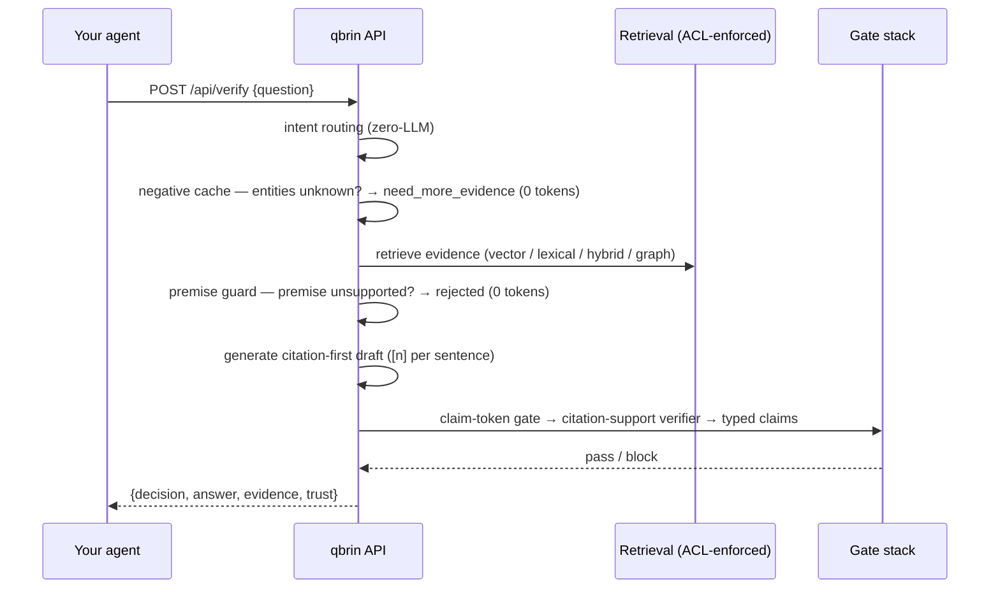

# qbrin — Building the Universal Trust Layer

**Retrieval tells the AI what it found. Qbrin decides whether it is safe enough to use.**

<p align="center">
  
</p>


Your agent is about to act. Is the thing it believes actually true in *your* systems?

qbrin sits between AI agents and an organisation's own sources (Postgres, Slack, Gmail, Drive, GitHub, uploads) and answers one question extremely well: **is this claim supported by the connected sources — yes, no, or not enough evidence?** Every verified answer carries a citation behind every sentence. When the evidence isn't there, qbrin says so instead of guessing.

```
pip install git+https://github.com/qbrin-stack/qbrin-python   # PyPI release coming soon
qbrin login          # sign in with Google — no token to copy
```

`qbrin login` opens your browser, authenticates with Google, and writes a scoped token to `~/.qbrin/credentials`. After that, `Qbrin()` just works — no key in code. *(A one-line `pip install qbrin` lands with the first PyPI release.)*

```python
from qbrin import Qbrin

qb = Qbrin()   # uses `qbrin login`; or Qbrin(api_key="qbrin_...")

v = qb.verify("Can I refund $500 for order ORD-200?")

v.decision      # "verified" | "rejected" | "need_more_evidence"
v.answer        # "[1] The refund limit for Support Managers is $300. ..."
v.explanation   # why qbrin decided this
v.evidence      # the cited source excerpts, with document ids and scores
v.claims        # per-claim verdicts from the verifier (verified answers only)
v.freshness     # evidence vintage + whether live query-in-place rows were used
v.trust         # the full trust certificate (gates run, axes, hashes)
```

Zero dependencies. Python ≥ 3.9. MIT.

## The decision contract

| Decision | Meaning | What your agent should do |
|---|---|---|
| `verified` | The answer shipped and **every claim passed the citation-support gate** against the cited sources. | Act on `answer`; log `evidence`. |
| `rejected` | The sources contain evidence **against** the premise (false-premise guard or typed-claim contradiction). | Don't act; surface `explanation`. |
| `need_more_evidence` | The sources can't confirm it — entities unknown, or no gate-passing answer exists. | Ask for more context, connect a source, or escalate to a human. |

The failure mode this kills: an agent confidently acting on something that was never true in your systems. On a 1,000-question benchmark against naive RAG, qbrin took hallucinations on nonexistent entities from **56% to 0%**, with **zero false accepts** on out-of-domain traps across every run to date.

## How a verification runs



Under the hood this is the same pipeline qbrin's own product surfaces use — one shared answer path is a trust invariant, so the benchmarks measure exactly what your agent gets. Highlights:

- **Citation-first generation** — every sentence must *begin* with its citation; an uncited sentence is dropped by construction.
- **Deterministic gates before any LLM spend** — unknown entities and false premises abstain at zero tokens.
- **A separate verifier model** audits each claim against only the chunks it cites, at temperature 0, fail-closed for API callers.
- **A recovery ladder** (graph-anchor traversal, executable retrieval plans, bounded graph walks) widens coverage on misses — and every recovered answer must clear the *same unchanged gates*, so recovery can never manufacture a false accept.
- **Per-identity ACL at the retrieval choke point** — the verification runs as *you*: sources your token's identity can't see are never used as evidence.

## Also in the box

```python
a = qb.ask("What is our refund policy?")   # grounded answer + citations
a.answer, a.citations, a.covered_by_map

hits = qb.search("refund policy", limit=10)  # universal search, no LLM
```

## Errors

```python
from qbrin import AuthenticationError, RateLimitError, FeatureDisabledError

try:
    v = qb.verify("...")
except RateLimitError as e:
    sleep(e.retry_after or 5)
except FeatureDisabledError:
    # the server hasn't enabled the verification endpoint (VERIFY_API=1)
    ...
```

The client retries 429/502/503/504 automatically (respecting `Retry-After`) and refuses non-HTTPS base URLs except localhost.

## Status & roadmap

The `verify` endpoint is in **beta** (flag-gated server-side). qbrin connects sources by **ingesting and indexing** them (poll/webhook → chunks → embeddings → knowledge graph), and by **live query-in-place**: at question time it probes your own systems read-only for records matching the question's entities and folds them into the audited evidence, so verification reflects the state of your systems *right now*, not the last index. Six live connectors ship today — **Postgres, MySQL, Salesforce, any REST/JSON API, Slack, GitHub** — each deterministic (no LLM ever writes a query; tables/objects/fields come from an admin allowlist; question values are bind parameters or URL-encoded params). See **[CONNECTING.md](CONNECTING.md)**.

On the roadmap: confidence bands, per-identity ACL for live sources, and streaming.

## Connecting your data

Your data reaches a verification two ways — indexed sources connected in the Console, or **live query-in-place** against your Postgres / MySQL / Salesforce / REST / Slack / GitHub. Live sources verify against *current* state and only ever read the exact records a question is about. Setup and the security model are in **[CONNECTING.md](CONNECTING.md)**.

A JavaScript/TypeScript SDK with the identical contract lives at **[qbrin-js](https://github.com/qbrin-stack/qbrin-js)**.

## Self-hosting & the server

This SDK talks to a qbrin server (hosted at `app.qbrin.com`, or your own deployment — pass `base_url`). The server codebase is not part of this repo.

---

Made by [qbrin](https://qbrin.com) — Building the Universal Trust Layer. Questions → katesaikishore@qbrin.com
